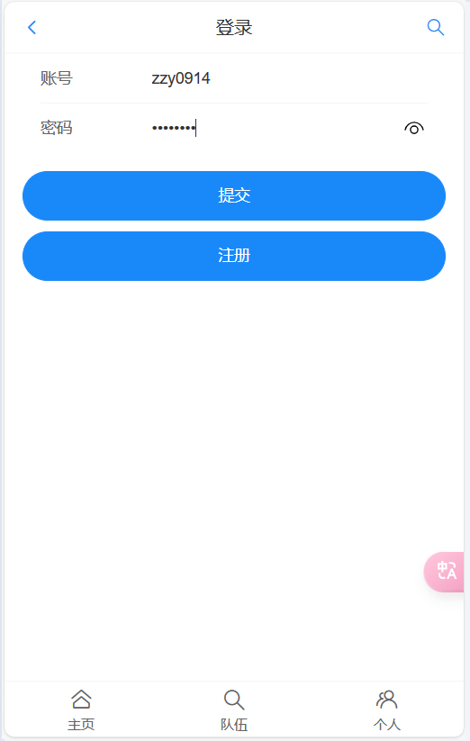
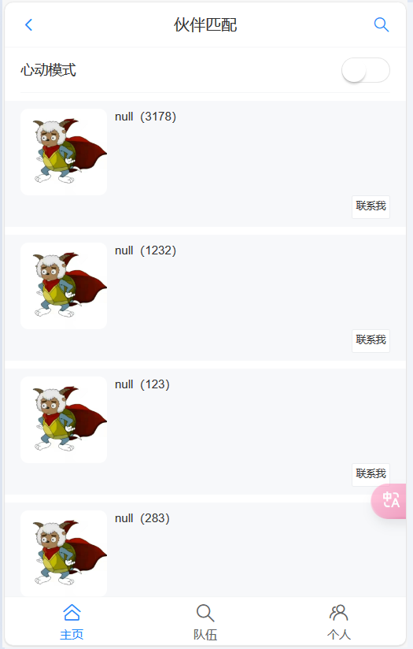
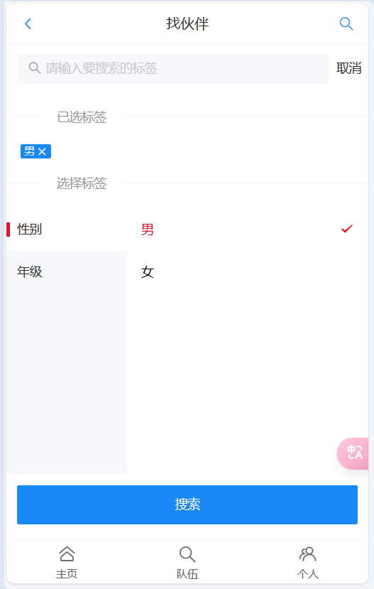
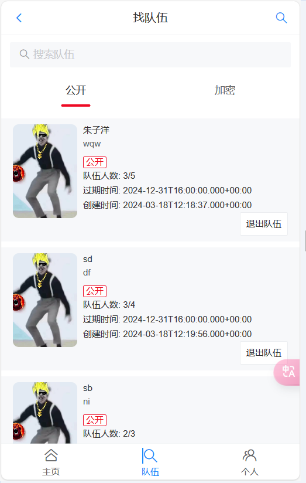
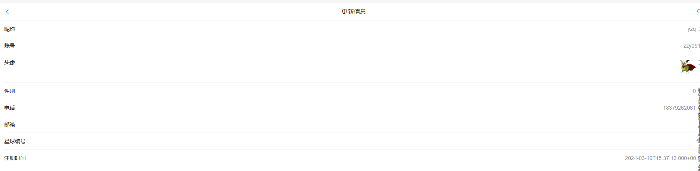
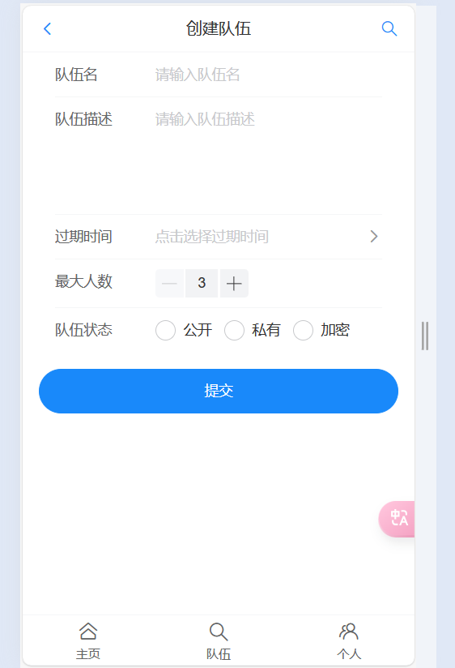
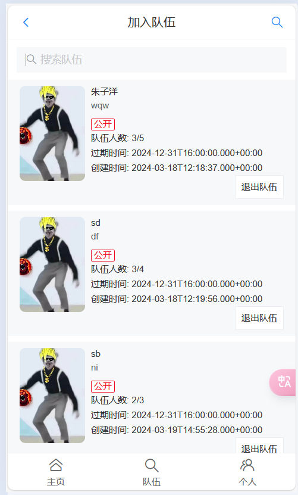

## 友友之家
### 1.项目介绍
帮助大家找到学习伙伴的移动端 H5 网站（APP 风格），基于 Spring Boot 后端 + Vue3 前端的 全栈项目，包括用户登录、更新个人信息、按标签搜索用户、建房组队、推荐相似用户等功能。

线上访问地址：http://8.138.132.63/

### 2.项目架构
#### 2.1 技术栈

- Java SpringBoot 框架
- MySQL 数据库
- MyBatis-Plus
- MyBatis X 自动生成代码
- Redis 缓存（多种 Java 实现方式）
- Redis 分布式登录
- Redisson 分布式锁
- Easy Excel 数据导入
- Spring Scheduler 定时任务
- Swagger + Knife4j 接口文档
- Gson：JSON 序列化库
#### 2.2 数据库
```sql
-- auto-generated definition
create table team
(
    id          bigint auto_increment comment 'id' primary key,
    name        varchar(256) not null comment '队伍名称',
    description varchar(1024) null comment '描述',
    maxNum      int default 1 not null comment '最大人数',
    expireTime  datetime null comment '过期时间',
    userId      bigint null comment '用户id（队长 id）',
    status      int default 0 not null comment '0 - 公开，1 - 私有，2 - 加密',
    password    varchar(512) null comment '密码',
    createTime  datetime default CURRENT_TIMESTAMP null comment '创建时间',
    updateTime  datetime default CURRENT_TIMESTAMP null on update CURRENT_TIMESTAMP,
    isDelete    tinyint default 0 not null comment '是否删除'
)
comment '队伍';

-- auto-generated definition
create table user
(
    username     varchar(256) null comment '用户昵称',
    id           bigint auto_increment comment 'id' primary key,
    userAccount  varchar(256) null comment '账号',
    avatarUrl    varchar(1024) null comment '用户头像',
    gender       tinyint default 0 null comment '性别',
    userPassword varchar(512) not null comment '密码',
    phone        varchar(128) null comment '电话',
    email        varchar(512) null comment '邮箱',
    userStatus   int default 0 not null comment '状态 0 - 正常',
    createTime   datetime default CURRENT_TIMESTAMP null comment '创建时间',
    updateTime   datetime default CURRENT_TIMESTAMP null on update CURRENT_TIMESTAMP,
    isDelete     tinyint default 0 not null comment '是否删除',
    userRole     int default 0 not null comment '权限（0 普通，1 管理员）',
    planetCode   varchar(512) null,
    tags         varchar(1024) null comment '标签列表'
);

-- auto-generated definition
create table user_team
(
    id         bigint auto_increment comment 'id' primary key,
    userId     bigint null comment '用户id（队长 id）',
    teamId     bigint null comment '队伍id',
    joinTime   datetime null comment '加入时间',
    createTime datetime default CURRENT_TIMESTAMP null comment '创建时间',
    updateTime datetime default CURRENT_TIMESTAMP null on update CURRENT_TIMESTAMP,
    isDelete   tinyint default 0 not null comment '是否删除'
)
comment '队伍';
```

### 3 前端演示
#### 3.1 登录

#### 3.2 心动模式


#### 3.3 标签搜索


#### 3.4 队伍列表

#### 3.5 修改本人信息


#### 3.6 创建队伍

#### 3.7 显示已加入队伍

